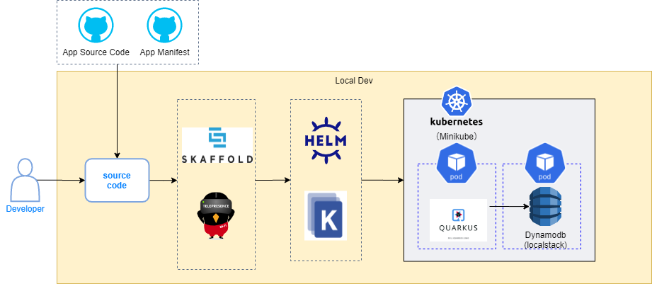

# nautible-app-customer project
このドキュメントには顧客アプリケーションについて記載する。
アプリケーション共通の内容については[こちら](https://github.com/nautible/docs/app-common/README.md)を参照。
Quarkusアプリケーション共通の内容については[こちら](https://github.com/nautible/docs/quarkus/README.md)を参照。

## アプリケーションの主要アーキテクチャ
* [Java11](https://www.oracle.com/java/)
* [Quarkus](https://quarkus.io/)
* [Maven](https://maven.apache.org/)
* REST
* [gRPC](https://grpc.io/)
* [Kubernetes](https://kubernetes.io/)
* [Docker](https://www.docker.com/)
* [AWS](https://aws.amazon.com/)

## Customerサービスが利用するAWSリソースとローカル環境での代替
|  開発環境(AWS)  |  ローカル環境  | 備考 |
| ---- | ---- | ---- |
| ECR | - |  |
| Dynamodb | Localstack |  |

## ローカル環境での開発方法
### ローカル開発イメージ図

### 事前準備
* [dockerのインストール](https://docs.docker.com/get-docker/)
* [minikubeのインストール](https://kubernetes.io/ja/docs/tasks/tools/install-minikube/)
* [kubectlのインストール](https://kubernetes.io/ja/docs/tasks/tools/install-kubectl/)（接続先の設定をminikubeにする
* [skaffoldのインストール](https://skaffold.dev/docs/install/)
* マニフェストファイルの配置
[nautible-app-customer-manifest](https://github.com/nautible/nautible-app-customer-manifest)をnautible-app-customerプロジェクトと同一階層に配置する(git clone)。

